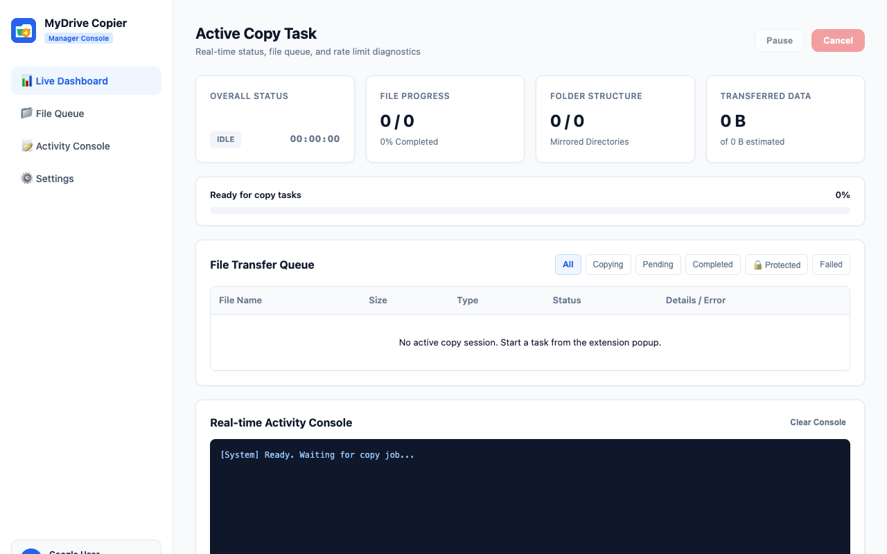
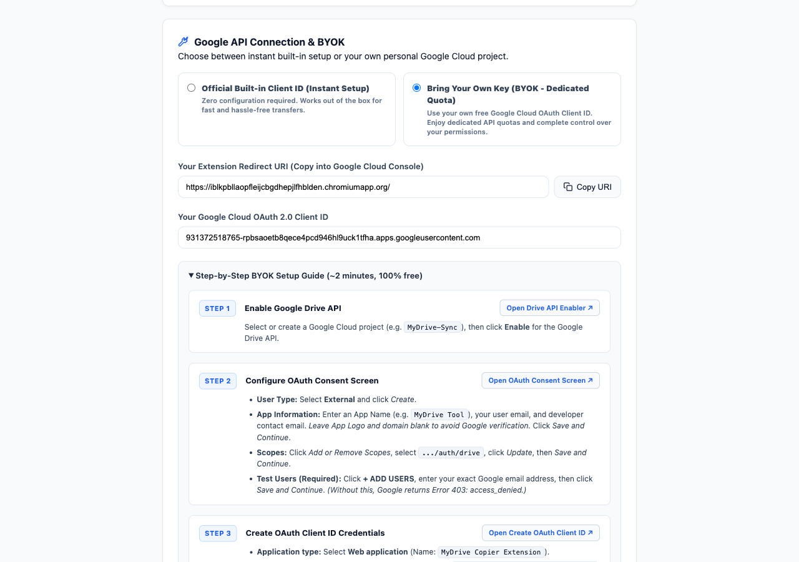

# MyDrive Copier 🚀
> **One-Click Recursive Google Drive™ Folder Duplicator for Chrome**

[](https://chromewebstore.google.com/detail/mydrive-copier-recursive/iblkpbllaopfleijcbgdhepjlfhblden)
[](https://github.com/magicbuaa/MyDriveCopier/releases/tag/v1.0.3)
[](https://developer.chrome.com/docs/extensions/develop/migrate/what-is-mv3)
[](LICENSE)

**MyDrive Copier** is a lightweight, high-performance Google Chrome extension (Manifest V3) that solves one of Google Drive's biggest missing features: **the ability to copy entire shared folders recursively with a single click**.

No downloading huge ZIP files. No wasting hours re-uploading gigs of data. Everything happens **100% cloud-to-cloud** directly inside Google's high-speed infrastructure.

---

## ⚡ The Problem: Google Drive's Missing Feature

If someone shares a folder containing dozens of subfolders and hundreds of files with you:
- ❌ **Google Drive does not let you right-click and "Make a copy" of a folder.**
- ❌ **Adding a shortcut doesn't duplicate the files**—if the original owner deletes or restricts them, you lose access.
- ❌ **Downloading and re-uploading** consumes gigabytes of your personal internet bandwidth, takes hours, crashes halfway, and breaks Google Docs/Sheets formatting.
- ❌ **Complex CLI tools (like rclone) or Apps Scripts** require technical setup, developer keys, and frequently hit rate limits (`User rate limit exceeded`).

### The Solution: MyDrive Copier
With **MyDrive Copier**, simply open the shared folder in your browser and click **Start Recursive Copy**. The extension scans the entire folder tree, recreates the exact directory structure in your Google Drive, and duplicates every file in parallel using Google Drive's native cloud APIs.

---

## 📸 Dashboard & Preview

| Real-Time Task Manager Dashboard | Configuration & BYOK Setup |
| :---: | :---: |
|  |  |

---

## ✨ Features

- 🌳 **True Deep-Tree Recursive Cloning**: Automatically traverses all nested subdirectories, preserves folder hierarchies, and mirrors all files (Google Docs, Sheets, Slides, PDFs, Videos, ZIPs, etc.).
- ☁️ **100% Cloud-to-Cloud Transfer**: 0 local bandwidth consumed. Files copy directly within Google's datacenters at maximum cloud speeds.
- 🔑 **Dual API Channels (Instant vs BYOK)**:
  - **Official Built-in Key**: Works instantly out of the box with zero configuration.
  - **Bring Your Own Key (BYOK)**: Connect your personal Google Cloud OAuth Client ID for 100% dedicated API quota and complete permission sovereignty.
- 🛡️ **Intelligent Quota & Rate-Limit Shield**: Built-in exponential backoff with randomized jitter automatically handles Google API `429` (Too Many Requests) and `403` (`userRateLimitExceeded`) errors.
- 🔄 **Resilient Background Service Worker**: Copy tasks run safely in the background. You can close the extension popup or browse other tabs without interrupting the copy process.
- 📊 **Dedicated Full-Page Manager Dashboard**:
  - Live progress percentage and transfer counters.
  - Active color-coded terminal log.
  - Granular file queue table (*Pending*, *Copying*, *Completed*, *Failed*, *Skipped*).
  - **One-Click Retry**: If a specific file fails due to Google transient limits, retry only the failed files without starting over.
  - Direct button to open the newly created destination folder in Google Drive.
- 🔍 **One-Click Tab Auto-Detection**: Auto-detects folder IDs directly from your active Google Drive tab (`/folders/...`, `/u/0/folders/...`, or shared URLs).
- 🔒 **Privacy-First & Zero Data Storage**: Your files never pass through any third-party servers. All API calls are executed directly between your Chrome browser and official Google Drive API endpoints.

---

## 📊 Comparison: Why MyDrive Copier?

| Feature | Manual Download & Upload | Google Apps Script | rclone CLI | MyDrive Copier |
| :--- | :---: | :---: | :---: | :---: |
| **Effortless 1-Click UI** | ❌ No | ❌ No | ❌ No | ✅ **Yes** |
| **Local Bandwidth Used** | ❌ 100% Upload/Download | ✅ 0% | ❌ High (or VPS) | ✅ **0% (Pure Cloud)** |
| **Preserves Folder Tree** | ⚠️ Often breaks ZIPs | ⚠️ Script dependent | ✅ Yes | ✅ **Exact 1:1 Mirror** |
| **Handles 429 Rate Limits** | ❌ Manual retry | ❌ Script timeout | ⚠️ Config needed | ✅ **Auto Exponential Backoff** |
| **BYOK Dedicated Quota** | ❌ N/A | ⚠️ Hardcoded in script | ⚠️ Complex config | ✅ **1-Click BYOK Toggle** |
| **Technical Setup Required** | None (but painful) | Medium (Script code) | High (CLI & config) | ✅ **None (Click & Go)** |
| **Background Execution** | ❌ Browser must stay open | ⚠️ 6 min max limit | ⚠️ Process dependent | ✅ **Service Worker** |

---

## 🔑 Dual Engine: Official Built-in vs. BYOK Mode

MyDrive Copier gives you complete flexibility over how API requests are routed:

### 1. Official Built-in Client ID (Default)
- **Zero Configuration**: Ready immediately upon installation.
- Perfect for everyday users, small-to-medium folders, and quick duplications.
- Uses official Google-verified OAuth credentials with automatic token lifecycle management.

### 2. Bring Your Own Key (BYOK Mode)
- **100% Dedicated API Quotas**: Google enforces a per-project API quota limit (~20,000 queries per 100 seconds). With your own Google Cloud project, you never share rate limits with anyone else.
- **Maximum Privacy & Compliance**: Organizations with strict security policies can run everything under their own Google Cloud Console project.
- **100% Free**: Google Cloud allows every user to create projects and OAuth credentials at zero cost.

---

## 🛠️ Step-by-Step BYOK Setup Guide (~2 minutes, 100% Free)

If you wish to use your own Google Cloud OAuth credentials:

### Step 1: Enable Google Drive API
1. Visit the [Google Cloud Console API Library](https://console.cloud.google.com/flows/enableapi?apiid=drive.googleapis.com).
2. Create or select a project (e.g., `MyDrive-Sync`).
3. Click **Enable** for the Google Drive API.

### Step 2: Configure OAuth Consent Screen
1. Go to [OAuth Consent Screen](https://console.cloud.google.com/apis/credentials/consent).
2. Choose **External** user type and click **Create**.
3. Fill in the App Name (e.g., `MyDrive Copier`) and your contact email. *(Leave app logo and domain blank to bypass Google verification)*.
4. **Scopes**: Add the `https://www.googleapis.com/auth/drive` scope.
5. **Test Users (Crucial)**: Under **Test users**, add your Google Account email address. *(Required when the app is in Testing status, preventing `Error 403: access_denied`)*.

### Step 3: Create OAuth Client ID
1. Navigate to [Credentials -> Create Credentials -> OAuth client ID](https://console.cloud.google.com/apis/credentials/oauthclient).
2. Select **Web application** as the application type.
3. Under **Authorized redirect URIs**, click **+ ADD URI** and paste your Extension Redirect URI:
   ```text
   https://iblkpbllaopfleijcbgdhepjlfhblden.chromiumapp.org/
   ```
4. Click **Create** and copy your newly generated **Client ID** (ends with `.apps.googleusercontent.com`).

### Step 4: Activate in Extension Settings
1. Right-click the MyDrive Copier icon in Chrome and open **Options / Settings** (or click the Settings gear in the popup).
2. Under **API & OAuth Credentials**, select **Bring Your Own Key (BYOK)**.
3. Paste your Client ID and click **Save BYOK Client ID**.
4. Click **Connect & Authorize Now** to complete authorization.

---

## 🚀 Installation & Getting Started

👉 **[Install MyDrive Copier from the Chrome Web Store](https://chromewebstore.google.com/detail/mydrive-copier-recursive/iblkpbllaopfleijcbgdhepjlfhblden)**

1. Click **Add to Chrome**.
2. Pin the extension to your browser toolbar for instant access.
3. Open any shared Google Drive folder link in Chrome.
4. Click the extension icon, click **Auto-Detect Tab**, and hit **Start Recursive Copy**!

---

## 🏗️ Architecture & Core Components

MyDrive Copier is engineered with modern Chrome Manifest V3 specifications for enterprise-grade stability and zero-loss copying:

- **Recursive Tree Scanner (`Google Drive API v3`)**: Traverses arbitrary depths of folder structures while dynamically resolving folder ID mappings and parent relationships.
- **Resilient Background Service Worker**: Runs long-running tree traversal and batch copying jobs independently of the popup UI, ensuring transfers complete even if tabs are switched.
- **Adaptive Concurrency & Exponential Backoff**: Continuously monitors Google Drive API rate limits (HTTP 403 / 429), throttling requests with randomized jitter to maximize transfer velocity.
- **Zero-Storage Direct Cloud Pipeline**: Transfers files server-to-server directly within Google's cloud fabric without downloading any payload to the client machine.

---

## 🛡️ Security & Privacy

- **Minimal Scopes**: We only request permissions necessary to read shared files and duplicate them into your drive.
- **No Middleman**: All Google Drive API calls are sent directly from your browser client to `https://www.googleapis.com/drive/v3/`. No file contents or metadata ever touch any external proxy.
- **Official Privacy Policy**: Read our full [Privacy Policy](https://mydrivecopier.com/privacy).
- **Terms of Service**: Read our [Terms of Service](https://mydrivecopier.com/terms).

---

## 💬 Community & Feedback

- Found a bug or have a feature request? Please [open an issue](https://github.com/magicbuaa/MyDriveCopier/issues)!
- Enjoying the extension? Please leave a 5-star review on the [Chrome Web Store](https://chromewebstore.google.com/detail/mydrive-copier-recursive/iblkpbllaopfleijcbgdhepjlfhblden)!

---

## 📄 License & Intellectual Property

Copyright (c) 2026 MyDrive Copier. All Rights Reserved.

This repository serves as the official documentation, issue tracking, and architecture showcase hub for MyDrive Copier. The underlying engine code, trademarks, and distributions are proprietary. Unauthorized commercial duplication or republication to extension stores is strictly prohibited. See [LICENSE](LICENSE) for details.
